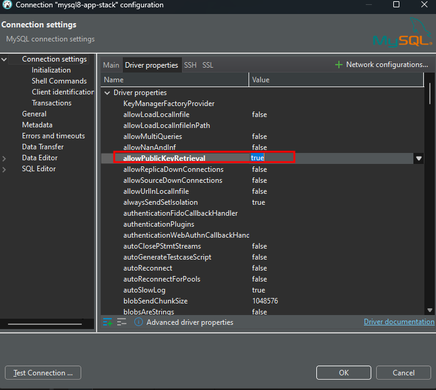
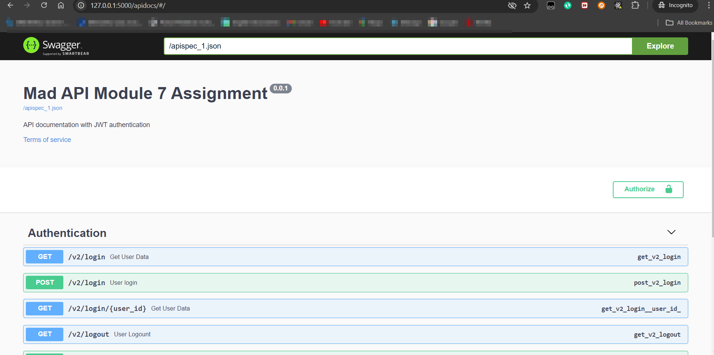
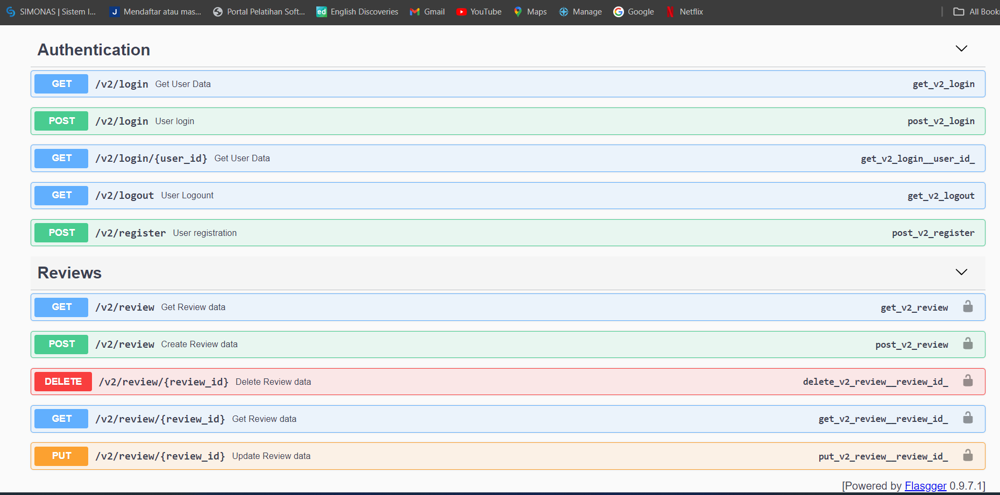
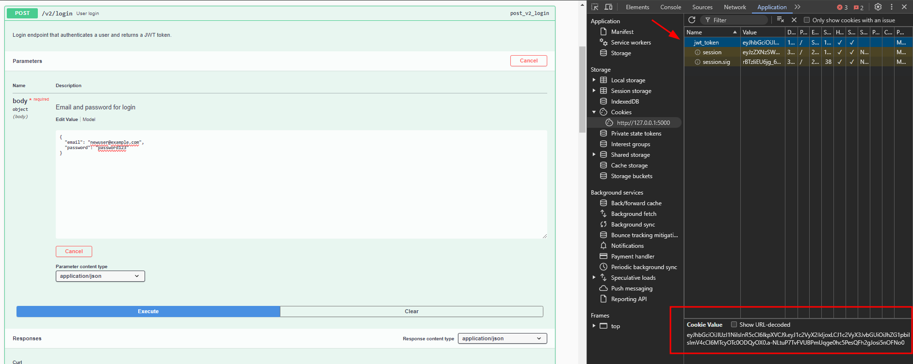
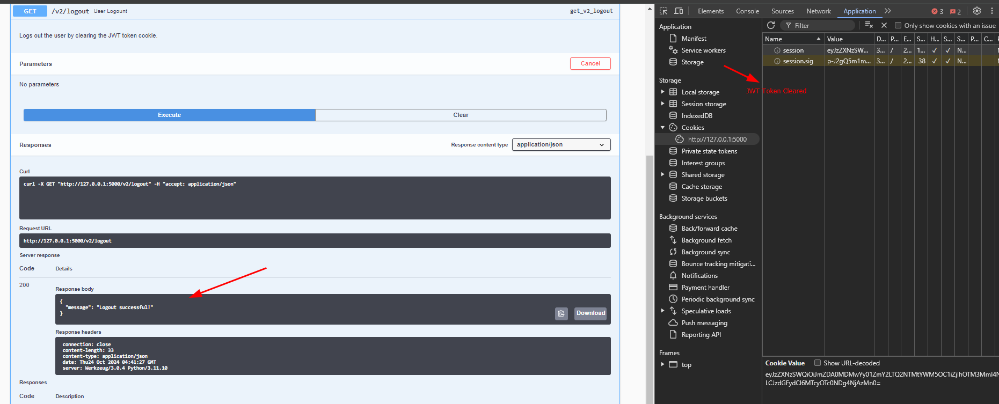

# Assignment Module 7

## Project Description

Simple Reviews CRUD API extended with the Authentication method

## Tech stacks

1. Pyenv for python multi version management
2. Python version ^3.11
3. Poetry for project app management

## API Documentation
Utilize swagger for API Documentation
```
URL: 
- http//:localhost:5000/apidocs
- http//:127.0.0.1:5000/apidocs
```

## Authentication
- Login: Generate JWT token from the authentication users with the specified role, and save the user session on the browser client
- Register: Add user by username, email, password and role
- Logout: destroy session from the browser client
- Add validation to check the authorize user to work with reviews endpoint (**admin** and **user** role)

## Deployment
### Docker Deployment
- Install Docker engine and docker-compose for Linux or Docker Desktop for Windows
- Run the docker-compose.yaml on the dockerized directory

    ```
    cd src/dockerized
    docker-compose up -d
    ```
- Access apidocs URL `http://localhost:5000/apidocs` or `http://127.0.0.1:5000/apidocs`

- `init.sql` contains the initial required database and tables for the apps (`dockerized/init.sql`)
- Clean up
    ```
    cd src/dockerized
    docker-compose down -v
    ```

### Native Deployment
- Install pre-requisite packages
    1. Python version 3.11
    2. Poetry

- Deployment steps:
    1. Clone this repository `git clone https://github.com/revou-fsse-5/module-7-kingahmadr.git`
    2. `cd module-7-kingahmdr`
    3. Run `poetry install`
    4. Adjust the `.env.example` to your `.env` environment config
    5. Run Flask using this example command:
        ```
        flask --app app --env-file .env run --port 5000 --debug
        ```

## Connect to the database
If you use the docker-compose deployment, I have prepared the mysql container in the definition.
Please adjust the connection setting on your DBeaver with the root credential defined on the compsoe file.
One more config to adjust on the connection setting, please ensure that the `allowPublicKeyRetrieval` set to **True**




### Snippet Apps










